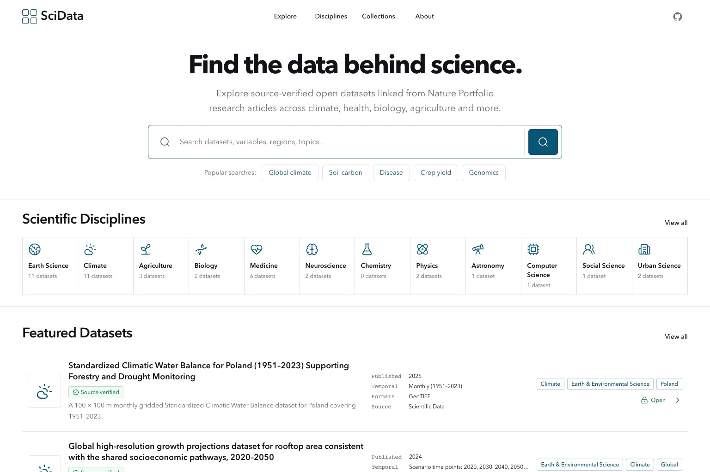
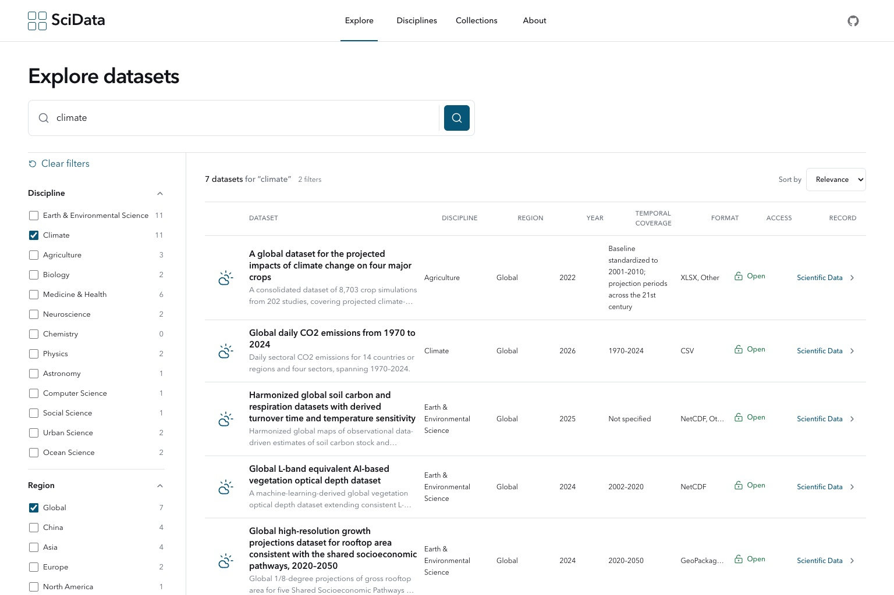
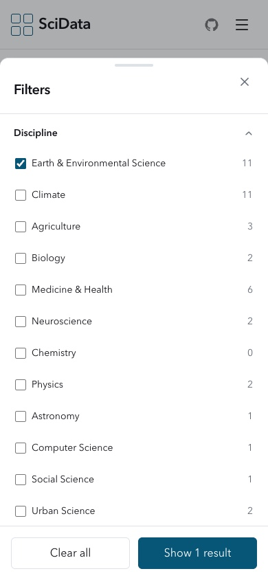

# SciData

**Discover scientific datasets across disciplines.**

SciData is a static-first scientific dataset discovery interface for researchers,
students, and data scientists. It focuses on three jobs: browse datasets, search their
metadata, and narrow results by discipline, region, publication year, format, and access.

The v0.1 catalogue contains 20 open datasets linked from *Scientific Data* articles
(19 Data Descriptors and one Analysis article). Every record links the journal article
and original repository and records the date on which both sources were manually checked.
SciData verifies discovery metadata; it does not independently reproduce a study or rate
fitness for a particular analysis.

**Live site:** [yuanyuanma03.github.io/SciData](https://yuanyuanma03.github.io/SciData/)

**Source:** [github.com/YuanyuanMa03/SciData](https://github.com/YuanyuanMa03/SciData)

## Screenshots







The generated design concepts, implementation captures, and browser QA ledger are kept
in [`docs/design-qa.md`](docs/design-qa.md).

## Features

- Browse featured and discipline-specific dataset metadata
- Keyword search across titles, descriptions, keywords, disciplines, regions, variables,
  and authors
- Combine search with discipline, region, year, format, and access filters
- Sort results by relevance, newest, oldest, or title
- Share search state through `/explore` URL query parameters
- Inspect complete metadata on dedicated dataset pages
- Follow journal and original-repository evidence for every production record
- Distinguish article, concept, and current-version DOIs when repositories expose them
- Browse discipline and curated collection entry points
- Use a mobile filter drawer and responsive single-column records
- Deploy as static files without a server, database, login, or paid API

## Tech stack

- React 19
- TypeScript in strict mode
- Vite 8
- Tailwind CSS 4
- shadcn/ui-style local components with Radix primitives
- Lucide Icons
- React Router
- MiniSearch

## Architecture

```text
public/
└── data/
    └── datasets.json         # Static catalog loaded once at runtime

src/
├── components/
│   ├── dataset/              # Featured and result dataset records
│   ├── filters/              # Desktop filters and mobile sheet
│   ├── layout/               # Header, footer, route shell
│   ├── search/               # Search input and suggestions
│   └── ui/                   # Local shadcn-style primitives
├── data/                     # Discipline and collection definitions
├── hooks/                    # Cached catalog loading and metadata helpers
├── i18n/                     # Typed English message catalog; locale-ready boundary
├── lib/                      # MiniSearch index, filters, sort, shared utilities
├── pages/                    # Route-level screens
├── types/                    # Scientific dataset schema
├── App.tsx                   # Route composition
└── main.tsx                  # React entry point
```

The browser fetches `datasets.json` through a module-level cached promise. MiniSearch is
constructed separately from the UI. Search, filters, and sorting are pure operations so
the catalog can later move to another static source without changing page components.

## Dataset schema

The source-of-truth TypeScript interface is in `src/types/dataset.ts`. The condensed shape
below shows both scientific metadata and the provenance fields required for production:

```ts
export interface ScientificDataset {
  id: string;
  title: string;
  description: string;
  authors: string[];
  disciplines: string[];
  keywords: string[];
  regions: string[];
  spatialCoverage?: string;
  spatialResolution?: string;
  temporalStart?: number;
  temporalEnd?: number;
  temporalCoverage?: string;
  temporalResolution?: string;
  variables: string[];
  formats: string[];
  publicationYear: number;
  journal?: string;
  publisher?: string;
  articleType?: string;
  paperDoi?: string;
  datasetDoi?: string;
  datasetConceptDoi?: string;
  datasetVersionDoi?: string;
  paperUrl?: string;
  datasetUrl: string;
  repository?: string;
  repositoryTitle?: string;
  repositoryPublicationDate?: string;
  license?: string;
  access: "open" | "restricted" | "registration";
  featured?: boolean;
  demo: boolean;
  verification: {
    status: "verified" | "partial" | "demo";
    verifiedAt: string;
    evidence: Array<{
      kind: "journal" | "repository" | "supplementary";
      label: string;
      url: string;
    }>;
  };
  provenanceSignals: string[];
  verificationNotes?: string[];
}
```

See [`docs/data-verification.md`](docs/data-verification.md) for the evidence policy and
the limits of the `verified` label.

## How to add datasets

1. Start from a *Scientific Data* article and inspect its article type and data-availability section.
2. Open the cited repository record and verify its DOI, access state, license, files, and
   version information against that original landing page.
3. Add an object to `public/data/datasets.json` with a stable, URL-safe, unique `id`.
4. Copy only fields supported by those two sources. Omit an unconfirmed optional field;
   never infer it from a title, search snippet, or likely file extension.
5. Store the DOI cited by the article in `datasetDoi`; use `datasetConceptDoi` and
   `datasetVersionDoi` only to preserve distinct repository concept/version identifiers.
6. Set `demo: false` and `verification.status: "verified"` only after both evidence links
   have been checked and dated. The production validation gate rejects demo records.
7. Use discipline, region, access, and format values consistently with existing records.
8. Run `npm run validate:data`, `npm run lint`, and `npm run build`, then exercise search,
   filtering, the detail route, and both outbound links in a browser.

SciData indexes metadata; it does not copy or host the dataset files themselves.

## Development

Requirements: a current Node.js release and npm.

```bash
npm install
npm run dev
```

Vite prints the local URL. Open it in a browser, then use `/explore` to exercise search and
filters.

To activate the header's GitHub link, set `VITE_GITHUB_URL` to the verified repository
URL. Without it, the GitHub control remains visibly disabled instead of linking to an
invented location.

## Build

```bash
npm run validate:data
npm run lint
npm run build
npm run preview
```

The production output is written to `dist/`. `npm run build` first enforces the catalogue
verification invariants, then runs strict TypeScript and the Vite build. It also emits
static entry files for every application route and copies `index.html` to `404.html` as
the fallback for unknown SPA routes.

## Deployment

### Cloudflare Pages

- Build command: `npm run build`
- Output directory: `dist`
- The bundled `_redirects` file provides SPA routing fallback.

### Vercel

- Framework preset: Vite
- Build command: `npm run build`
- Output directory: `dist`
- `vercel.json` rewrites application routes to `index.html`.

### GitHub Pages

The repository includes `.github/workflows/deploy-pages.yml`. Every push to `main` runs
the data validation gate, lint, strict TypeScript build, and Vite production build before
deploying `dist/` with GitHub's official Pages actions.

For a manual subpath build, set `VITE_BASE_PATH` to the repository path:

```bash
VITE_BASE_PATH=/SciData/ \
VITE_GITHUB_URL=https://github.com/YuanyuanMa03/SciData \
npm run build
```

`BrowserRouter` reads Vite's base path. Generated route entry files let known routes load
directly with HTTP 200, while `404.html` remains the fallback for unknown routes.

## Roadmap

### v0.1

- Dataset browsing
- Keyword search
- Filters
- Dataset pages
- Disciplines
- Collections

### v0.2

- Automated metadata collection
- Dataset validation
- More sources

### Future

- Semantic search
- Dataset recommendations
- Dataset comparison

Future items are roadmap only and are not implemented in v0.1.

## License

No project license has been selected yet. Dataset metadata and linked files remain subject
to their original repositories and licenses.
